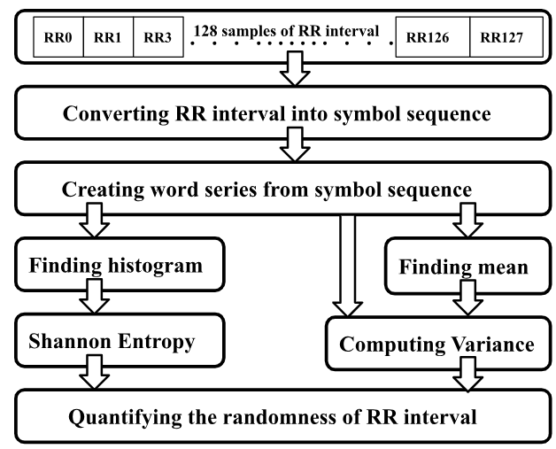
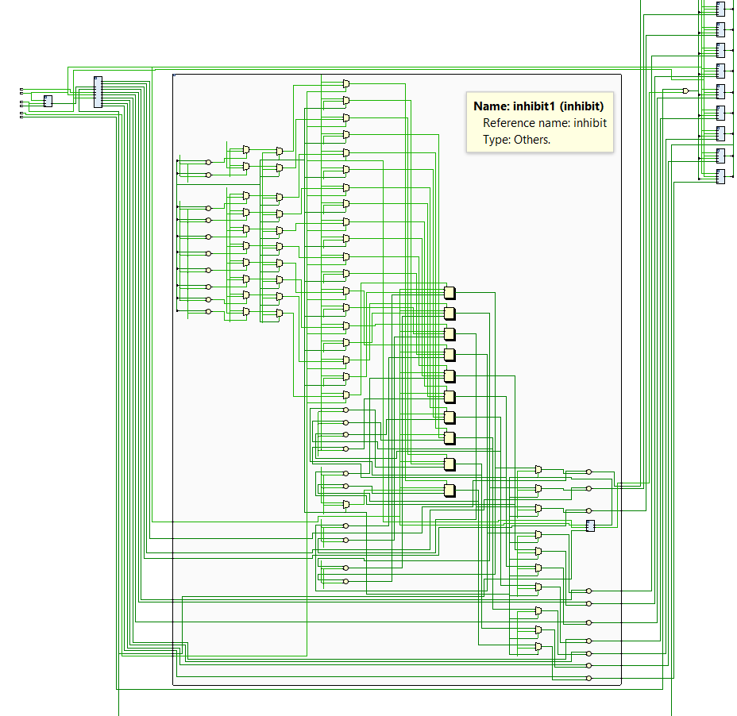
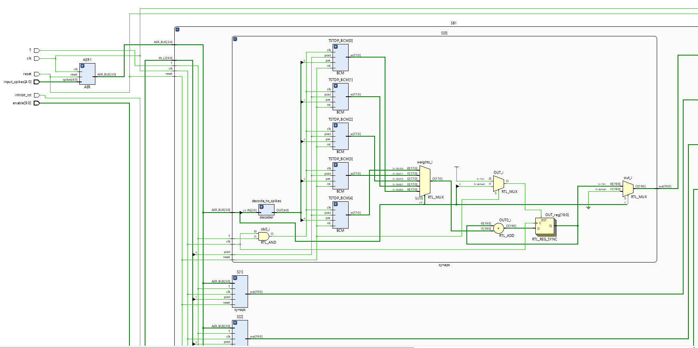

# SPIKING-NEURAL-NETWORK
This is a spiking neural network designed in verilog, This netwoek used izhekevich neuron as as neuron model and aer controller for communication, and BCM block for learning.

